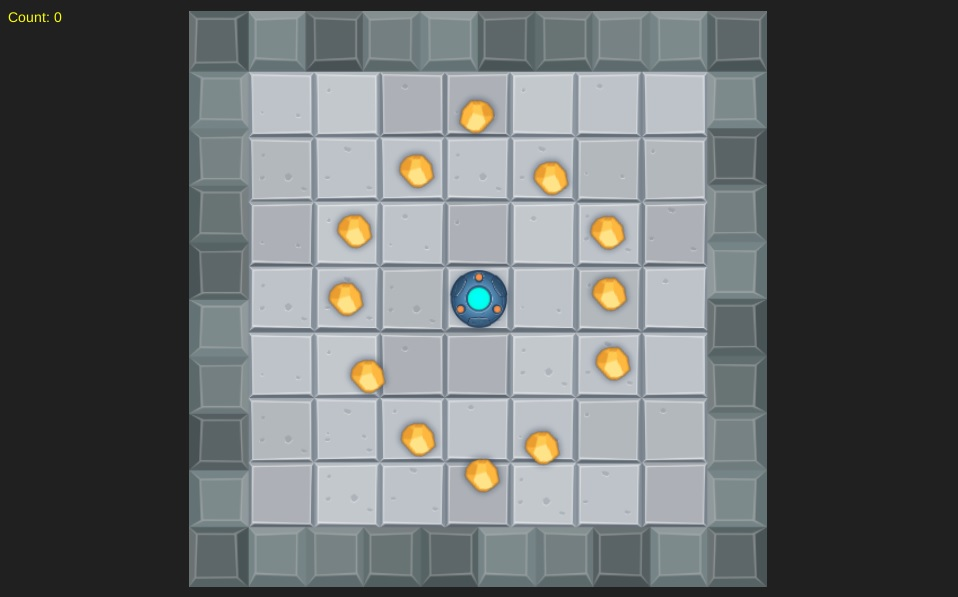
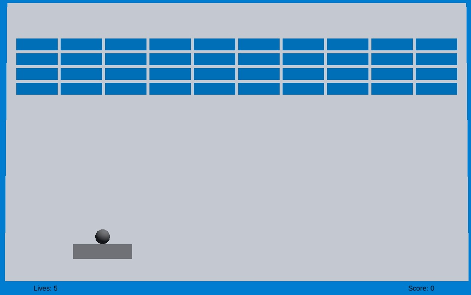
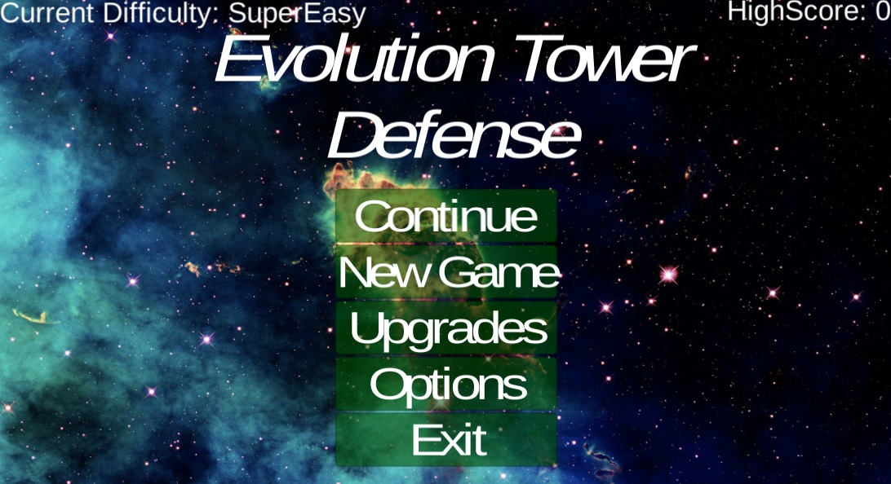
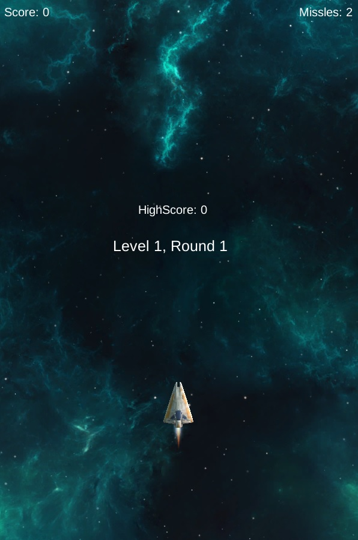

## Welcome to Rob's GitHub Pages

This repository uses GitHub Pages and Markdown files.

### Topics of Interest
1. [Unity Augmented Reality](https://robsap.github.io/#)
2. [Unity Games](https://robsap.github.io/#)
3. [Operating Systems](https://robsap.github.io/#)
4. [Android Applications](https://robsap.github.io/#)
5. [Machine Learning](https://robsap.github.io/#)
6. [Deep Learning](https://robsap.github.io/#)
7. [Group Projects](https://robsap.github.io/#)
  a. [Virtual Pond](https://robsap.github.io/#) - An Address Book
  b. [Tower Defense](https://robsap.github.io/#)
8. [Interview Practice Problems](https://robsap.github.io/#)
9. [Parallel Programming](https://robsap.github.io/#)
10. [Other](https://robsap.github.io/#)

```markdown

```
###Unity Games
This is a list of my Unity Based Projects. Click on the links to play, or select other projects to view source code.
Android projects will be linked soon.
							 
###Playable Games

####Rolla Ball
[Rolla Ball](images/BallRoller.jpg)(https://robsap.github.io/UnityGamesWebGl/BallRoller/index.html)
Info: [Rolla Ball](https://robsap.github.io/UnityGamesWebGl/BallRoller/index.html)


####Rolla Ball test
[Rolla Ball](https://robsap.github.io/UnityGamesWebGl/BallRoller/index.html)
Info: [Rolla Ball](https://robsap.github.io/UnityGamesWebGl/BallRoller/index.html)

####UFO Game
(https://robsap.github.io/UnityGamesWebGl/UFOGame/index.html)
Info:  UFO Game. 5 levels. Collect the Cubes, and avoid others.

####Rolla Ball

Info: [Rolla Ball](https://robsap.github.io/UnityGamesWebGl/BallRoller/index.html)

####Rolla Ball

Info: [Rolla Ball](https://robsap.github.io/UnityGamesWebGl/BallRoller/index.html)

####Rolla Ball

Info: [Rolla Ball](https://robsap.github.io/UnityGamesWebGl/SpaceShooter/index.html) 


					<a target="_blank" href="Breakout/index.html">
						
					</a>
					<div class="desc">Simple breakout game. 1 level, 5 lives. Working on more levels, high score and other features.</div>
					
--


					<a target="_blank" href="TowerDefense/index.html">
						
					</a>
					<div class="desc">Group project for school. Evolution tower defence. Look at the options for difficulty and sound.</div>

--

					<a target="_blank" href="SpaceShooter/index.html">
						
					</a>
					<div class="desc">Classic Space Shooter. Based off Unity's Tutorial. 3 Levels with 2 waves</div>
				</div>
--
				<div class="img">
					<a target="_blank" href="#">
						
					</a>
					<div class="desc">Description of my project Image here</div>
				</div>
--
				<div class="img">
					<a target="_blank" href="#">
						
					</a>
					<div class="desc">Description of my project Image here</div>
				</div>
--
				<div class="img">
					<a target="_blank" href="#">
						
					</a>
					<div class="desc">Description of my project Image here</div>
				</div>


### Contact

Email 
